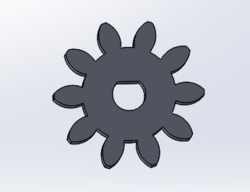
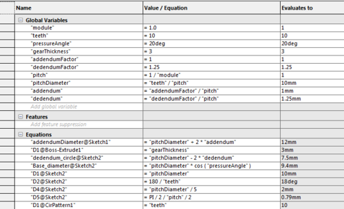
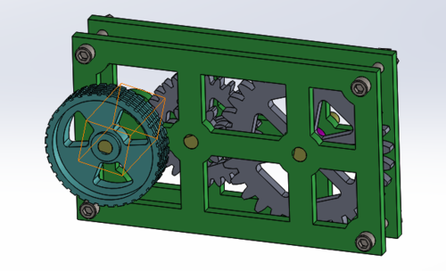
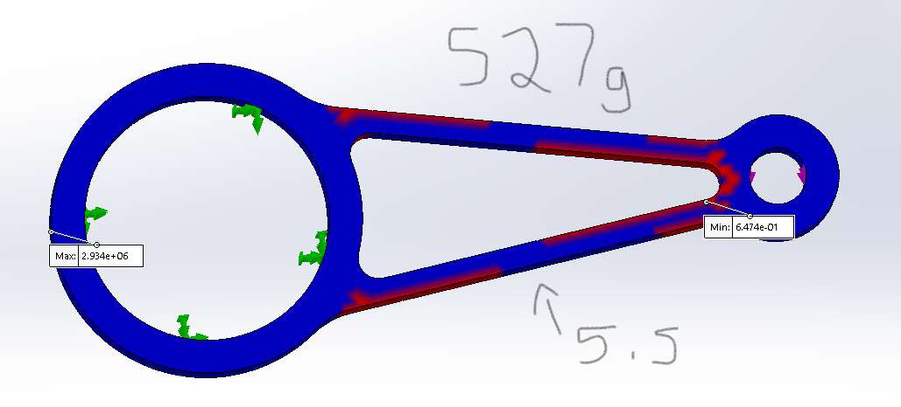
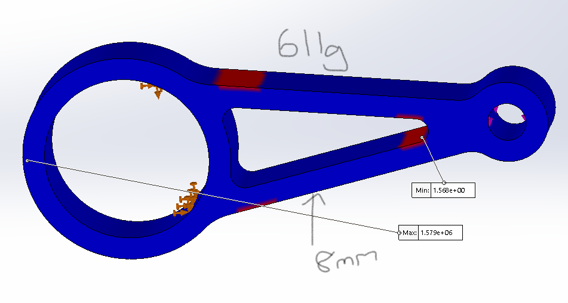
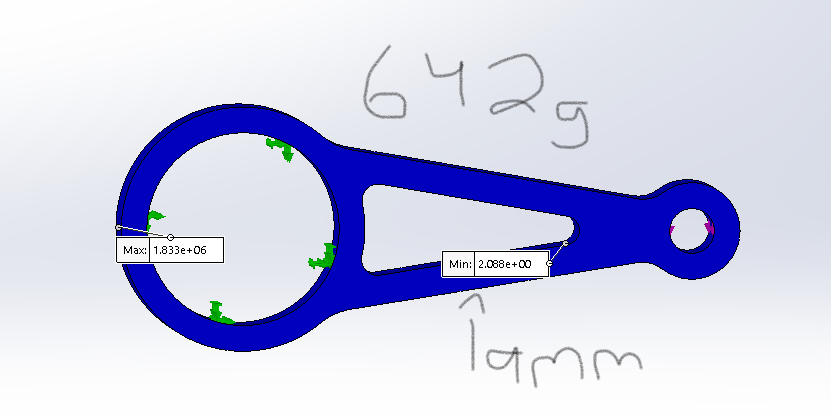
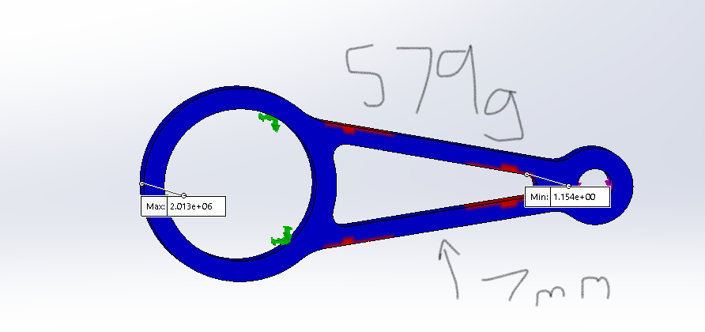
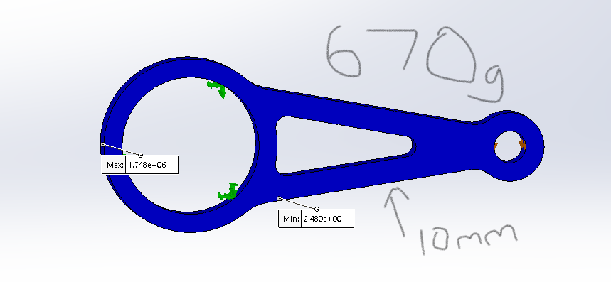

# Advanced-CAD
My Advanced-CAD assignments:

## Table of Contents
* [Table of Contents](#Table-of-Contents)
* [Gears](#Gears)
* [Gearbox](#Gearbox)
* [Motion Analysis](#Motion-Analysis)
* [Stress Analysis](#Stress-Analysis)

## Gears

### Objective

In this assignmnet I made 4 different configurations of a gear in solidworks utilizing equations to create the individual gears with ease, rather than starting each individual gear from scratch. This assignment is designed to ultimately create a gearbox in which the gears mesh perfectly and function just as well.

### Lesson(s) Learned

The terminology involved with the gears is definitely something that will take a while to completely understand and use in the future. In all, the solidworks wasn't too difficult, I struggled a bit to make the cut for the teeth of the gear, it's good to make sure that all the lines are fixed (black rather than blue) before making the cuts for the teeth, the rest was prior knowledge regarding configurations and such. It is also good to remember using equals signs before using/writing an equation in smart dimension.

### Image

## Gearbox

### Objective

Using the gears made in the previous assignment as well as several other parts (axle, spacer, knob, and a plate), I made several sub assemblies which I then made into one final assembly, the gearbox.

### Lesson(s) Learned

The hardest part was definitely the plate on which the gear assemblies would be placed. What made it particularly difficult was the lack of instruction provided with which to complete the part. I found it useful to estimate the size of the windows as you won't be able to completely know them until you start making the gearbox assembly, remembering to also use trim entities to create your window cutouts. I also found some difficulty using gear mates to make the gears mesh perfectly, I looked up a video on this, but never completely solved this problem, I made it better, but not a complete mesh unfortunately.

### Image

## Motion Analysis

### Objective

This assignment required us to make 6 seperate parts to form an assembly which we would then use to perform a motion study using Solidworks Simulation. The Solidwork Simulation program allows us to apply certain forces (gravity) to the assembly and see how the assembly would respond given the movement of a motor (servo). This makes testing assemblies much easier.

### Lesson(s) Learned

The contruction of the assembly was fairly easy, apart from learning how to use the shell feature and offset entities, it was a review of the solidworks mechanics. The motion study aspect was a bit more difficult as it had us using a new program, the instructions were easy to follow, however, I initially messed up the direction that the servo would rotate so my motion study would turn in a negative direction (towards the stand). The only advice I would give is to follow the directions closely so as not to miss anything. 

### Image

## Stress Analysis

### Objective

This assignment had us follow a sketch to create a design that we would test in the SimulationXpress Analysis Wizard program. This program allows us to fix certain points of the piece and apply forces to others to see how strong the piece is. Using this data, we attempted to create a piece that was both strong, in terms of the Factor of Safety (FOS), and light. 

### Lesson(s) Learned

The construction of the piece required several relations, notably making lines tangent to the circles and making lines parallel to the outer edge to fully constrain them. In messing around with the piece to increase the FOS, I initially made the fillet thicker, which worked to some extent, but the best option was to make a wall in the center of the piece that was very thin.

### Image

 Original

 
 

 
